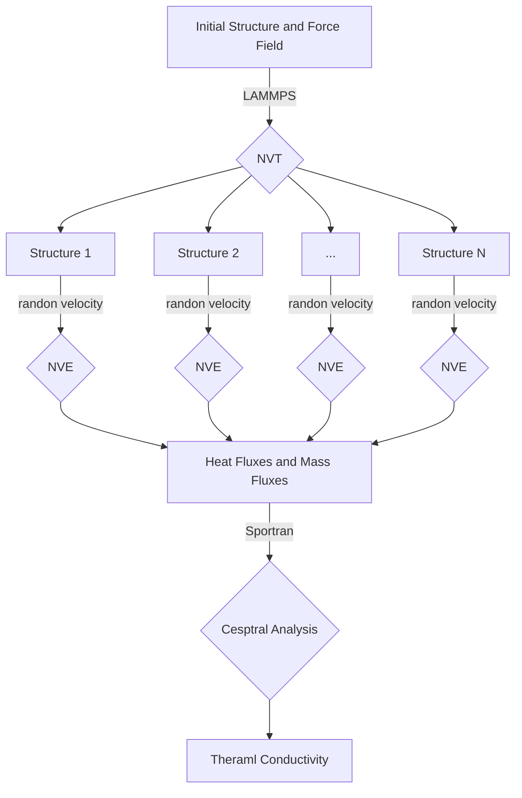
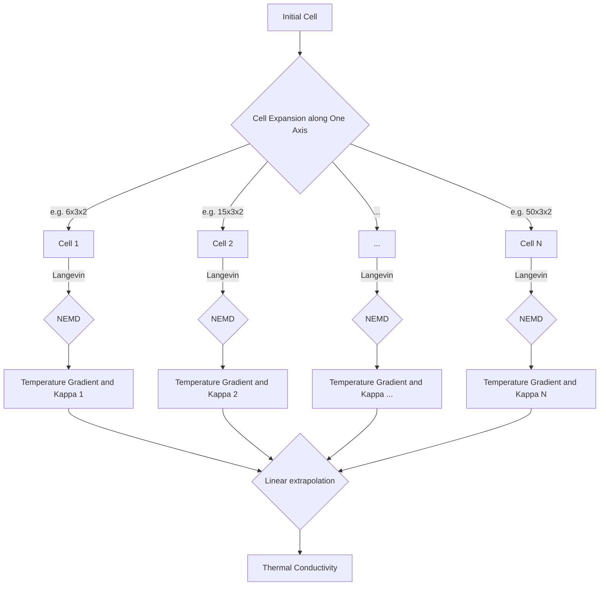

# Table of contents
- [About ThermalConductivity-Workflow](#ThermalConductivity-Workflow)
- [Workflow Framework](#Workflow-Framework)
- [Prepare Input File](#Prepare-input-file)
# About ThermalConductivity-Workflow
ThermalConductivity-Workflow is designed to compute thermal conductivity of different materials based on Non-Equilibrium &amp; Equilibrium Molecular Dynamics Simulations. It is supported by [dflow](https://github.com/deepmodeling/dflow), a Python framework for constructing scientific computing workflows.

## About dflow
With the power of dflow, users can easily minitor the whole workflow of ThermalConductivity tasks and dispatch their tasks to various computational resources. Before you use it, you should have dflow installed on your host computer (your PC or a remote server).

It it necessary to emphasize that, the computational nodes and monitor nodes are seperated. With dflow, you can deploy dflow and ThermalConductivity on your PC and achieve expensive computation on other resources (like Slurm and Cloud Platform) without any further effort.

Instructions of dflow installation are provided in detail on its [Github page](https://github.com/deepmodeling/dflow#Installdflow). Prerequisites of dflow usage are Docker and Kubenetes, where their main pages ([Docker](https://docs.docker.com/engine/install/) &amp; [Kubenetes](https://kubernetes.io/docs/tasks/tools/) include how you can install them. Besides, dflow repo also provides with easy-install shell scripts on [dflow/scripts](https://github.com/deepmodeling/dflow/tree/master/scripts) to install Docker &amp; Kubenetes &amp; dflow and make port-forwarding.

# Environment Installation
The overall workflow logic is as follows: The necessary preparation files for the workflow are uploaded to a remote server (currently, Bohrium provides free resources for this part). Then, the remote server distributes the tasks to different supercomputing resources and computing environments based on the set parameters. In practice, we need to prepare two parts of the environment.
* tcflow, the necessary package in the host machine
* computational environment, needed in both host and computing machine
## Installation of task submission environment.
  
The task submission environment can be from any device, whether it is a personal PC or a connected supercomputing head node. Its main task is to package the necessary preparation files and upload them to the remote server. This environment can be set up using pip installation.
```bash
pip install tcflow==0.0.22
```

## Installation of computing environment
The computational environment is supported by several third-party python packages. Dflow provides a framework for scheduling computing resources, but the actual computing environment needs to be configured in advance.
For users of [Bohrium](https://bohrium.dp.tech/), this step is relatively easy as we provide relevant images, which can be directly called. 

*Please note that registering a Bohrium account is essential for the visualization interface of the subsequent workflow, regardless of whether Bohrium computing resources are called or not.

For users of other computing resources, we have packed the required environment for most of the computational steps, which can be easily installed via pip.
Similar to the task submission environment:
```bash
pip install tcflow==0.0.22
```

In the workflow, the computing environment for LAMMPS needs to be prepared by the user. If you are using dp+LAMMPS, you can refer to the [Easy Install](https://docs.deepmodeling.com/projects/deepmd/en/master/install/easy-install.html) or [Install LAMMPS](https://docs.deepmodeling.com/projects/deepmd/en/master/install/install-lammps.html) documentation provided by DeepModeling for instructions on installing LAMMPS in conjunction with Deep Potential (dp).
For other cases or custom configurations, you can follow the specific requirements and instructions provided by LAMMPS. The official LAMMPS documentation (https://lammps.sandia.gov/doc/Manual.html) provides comprehensive information on how to install LAMMPS for different platforms and configurations. You can refer to the documentation that matches your specific setup and requirements.

*Example of LAMMPS environment installation, using conda for dp+LAMMPS in a GPU environment, referring to [Easy Install](https://docs.deepmodeling.com/projects/deepmd/en/master/install/easy-install.html).
```bash
conda create -n deepmd deepmd-kit=*=*gpu libdeepmd=*=*gpu lammps cudatoolkit=11.6 horovod -c https://conda.deepmodeling.com -c defaults
```

# Workflow Framework
## EMD(Equilibrium Molecular Dynamics Simulations) 
The process of computing thermal conductivities with EMD is as follows:


## NEMD(Non-Equilibrium Molecular Dynamics Simulations) 
The process of computing thermal conductivities with NEMD is as follows:

# Prepare Input Files
Firstly, we introduce the input files required for the ThermalConductivity.Input files in example/ have been prepared. 
The following files is needed:
* data.lammps, the input structure file of lammps format
* parameters.json, the settings for simulations and tasks
* machine.json, the settings for computing resources
* force field(if needed), the force field file used in lammps MD

## Prepare parameters.json
### parameters.json of EMD
parameters.json for emd in /example/emd/H2O 
```Json
{
    "type_map": ["H","O"],
    "mass_map": [1,16],
    "temperature":408,
    "time_step": 0.0002,
    "thermo_print_interval": 10,
    "traj_print_interval": 1000,
    "structure":"./data.water",
    "is_two-body-potential":false,
    "force_field":["frozen_model_compressed.pb"],
    "load_force_field":["pair_style deepmd frozen_model_compressed.pb","pair_coeff * *"],
    "num_configurations":10,
    "NVT_steps":1000000,
    "NVE_steps":1800000,
    "md_command":"mpirun -n 1 lmp < in.lammps"
}
```

Description of parameters
| Parameters| Type          | Description  |
| --------------------- | ---------------------- | ----------------------------- |
|type_map|list of str|Give the name to each type of atoms.|
|mass_map|list of float|Give the mass to each type of atoms.|
|time_step|float|Set the timestep size for subsequent molecular dynamics simulations.unit:ps|
|thermo_print_interval|int|Output thermodynamics every "thermo_print_interval" timesteps.[themo](https://docs.lammps.org/thermo.html)|
|traj_print_interval|int|Dump structures on timesteps which are multiples of "traj_print_interval".[dump](https://docs.lammps.org/dump.html)
|structure|str|The file path of structure in lammps format.|
|is_two-body-potential|bool|"true" for the two-body force field. For example,L-J potential.|
|force_field|list of str|The file paths of force field needed for simulation|
|load_force_field|list of str|The command to load a force field in an LAMMPS input file.|
|num_configurations|int|The number of independent simulation trajectories.|
|NVT_steps|int|The steps for NVT equilibrium before the NVE simulation.|
|NVE_steps|int|The steps for NVE simulation. All the data generated will be used to calculate thermal conductivity.|


### parameters.json of NEMD
parameters.json for emd in /example/nemd/Ar
```Json
{
    "type_map": ["Ar"],
    "mass_map": [40],
    "time_step": 0.001,
    "supercell": [[5,1,1],[6,1,1],[8,1,1],[10,1,1]],
    "temperature":60,
    "temperature_difference":10,
    "linear_scale":[0.05,0.95],
    "thermo_print_interval": 1000,
    "traj_print_interval": 1000,
    "structure":"./data.ar",
    "force_field":[],
    "load_force_field":["pair_style lj/cut 10.0","pair_coeff * * 1.032e-2 3.405"],
    "langevin_damp":1.0,
    "NVT_steps":1000000,
    "NEMD_equilibrium_steps":2000000,
    "NEMD_production_steps":10000000,
    "md_command":"mpirun -n 1 lmp < in.lammps"
}
```

description of parameters
| Parameters| Type          | Description  |
| --------------------- | ---------------------- | ----------------------------- |
|type_map|list of str|Give the name to each type of atoms.|
|mass_map|list of float|Give the mass to each type of atoms.|
|time_step|float|Set the timestep size for subsequent molecular dynamics simulations.unit:ps|
|supercell|list of ternary arrays|Super cells to be calculated.The direction of heat flow is fixed along the x-axis.|
|temperature|float|The average temperature of the system.|
|temperature_difference|float|The temperature difference between the heat source(sink) and the average temperature.|
|linear_scale|[float,float]|The linear range of temperature distribution between the heat source and the heat sink.|
|thermo_print_interval|int|Output thermodynamics every "thermo_print_interval" timesteps.[themo](https://docs.lammps.org/thermo.html)|
|traj_print_interval|int|Dump structures on timesteps which are multiples of "traj_print_interval".[dump](https://docs.lammps.org/dump.html)|
|structure|str|The file path of structure in lammps format.|
|force_field|list of str|The file paths of force field needed for simulation|
|load_force_field|list of str|The command to load a force field in an LAMMPS input file.|
|langevin_damp|float|The parameter of fix/langevin in LAMMPS. [fix/langevin](https://docs.lammps.org/fix_langevin.html)  The _damp_ parameter is specified in time units and determines how rapidly the temperature is relaxed. For example, a value of 100.0 means to relax the temperature in a timespan of (roughly) 100 time units (τ or fs or ps - see the [units](https://docs.lammps.org/units.html) command). The damp factor can be thought of as inversely related to the viscosity of the solvent. I.e. a small relaxation time implies a high-viscosity solvent and vice versa.|
|NVT_steps|int|The steps for NVT equilibrium.|
|NEMD_equilibrium_steps|int|The steps for equilibrium stage of NEMD. It should be long enough to generate a stable temperature gradient|
|NEMD_production_steps|int|The steps for production stage of NEMD. All the data generated will be used to calculate thermal conductivity|
|md_command|str|The command to run the lammps|


# Prepare machine.json
machine.json for nemd in /example/nemd/Ar
```json
{
    "machine_type":"cluster",
    "email": "",
    "password": "",
    "program_id":1234,
    "host": "",
    "port":22,
    "username": "",
    "ssh_password": "",
    "remote_root":"/data/home/test/ar",
    "md_machine_dict":{
	    "batch_type": "slurm",
	    "local_root": "./",
	    "context_type": "SSHContext",
	    "clean_asynchronously":false
    },
    "md_resources_dict":{
	    "number_node": 1,
	    "cpu_per_node": 1,
	    "gpu_per_node": 0,
	    "queue_name": "",
	    "group_size": 1,
	    "custom_flags": [
	         "#SBATCH --time=0-1000:00:00",
	        ],
	    "source_list": ["activate deepmd_2.1.4"],
	    "batch_type": "Slurm"
    },
    "analysis_machine_dict":{
	    "batch_type": "slurm",
		"local_root": "./",
		"context_type": "SSHContext",
		"clean_asynchronously":false
    },
    "analysis_resources_dict":{
	    "number_node": 1,
	    "cpu_per_node": 1,
	    "gpu_per_node": 0,
	    "queue_name": "",
	    "group_size": 1,
	    "custom_flags": [
	          "#SBATCH --time=0-1000:00:00",
	         ],
	    "source_list": ["activate deepmd_2.1.4"],
	    "batch_type": "Slurm"
    }
}
```
description of parameters
| Parameters| Type          | Description  |
| --------------------- | ---------------------- | ----------------------------- |
| machine_type   |    str    |  The type of user's computing resouces.If using [Bohrium](https://bohrium.dp.tech/),it should be "bohrium".The others should be "cluster"|
|email | str|The username of the Bohrium account. It can be email or telephone number.|
|password|str|The password of the Bohrium account|
|program_id|int|The program id of corresponding pragram|
|host|str|The host for connecting to remote computing resources.|
|port|int|The port for connecting to remote computing resources|
|username|str|The username for connecting to remote computing resources|
|ssh_password|str|The password for connecting to remote computing resources|
|remote_root|str|The working path in remote computing resources |
|md_machine_dict|json|Machine parameters for running md.GPU is recommended.Refer to the description in dpdispatcher.[machine parameters](https://docs.deepmodeling.com/projects/dpdispatcher/en/latest/machine.html#) |
|md_resouces_dict|json|Resources parameters for running md.GPU is recommended.Refer to the description in dpdispatcher.[resources parameters](https://docs.deepmodeling.com/projects/dpdispatcher/en/latest/resources.html)|
|analysis_machine_dict|json|Machine parameters for analysis part. The description is the same as md_machine_dict|
|analysis_resouces_dict|json|Resources parameters for analysis part. The description is the same as md_resources_dict|


### For Bohrium users
Bohrium integrates well with dflow for resource scheduling, and the parameter configuration is relatively simpler. An example used on the Bohrium platform is as follows:
```json
{
    "machine_type":"bohrium",
    "email": "",
    "password": "",
    "program_id":1234,
    "lammps_image":"registry.dp.tech/dptech/lammps:23Jun2022-dp2.1.5",
    "tc_image":"registry.dp.tech/dptech/thermal-conductivity:v0.12",
    "cpu_scass_type": "",
    "gpu_scass_type": ""
}
```
description of parameters
| Parameters| Type          | Description  |
| --------------------- | ---------------------- | ----------------------------- |
| machine_type   |    str    |  The type of user's computing resouces.If using [Bohrium](https://bohrium.dp.tech/),it should be "bohrium".The others should be "cluster"|
|email | str|The username of the Bohrium account. It can be email or telephone number.|
|password|str|The password of the Bohrium account|
|program_id|int|The program id of corresponding pragram|
|lammps_image|str|The container image in bohrium platform for running the LAMMPS|
|tc_image|str|The container image in bohrium platform for this workflow|
|cpu_scass_type|str|The machine type of cpu resources for analysis.You can find it [here](https://bohrium.dp.tech/profiler)|
|gpu_scass_type|str|The machine type of gpu resources for running md.You can find it [here](https://bohrium.dp.tech/profiler)|
