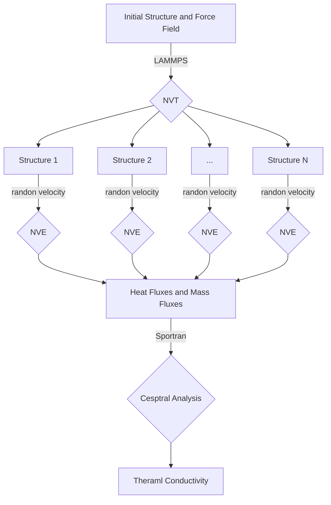
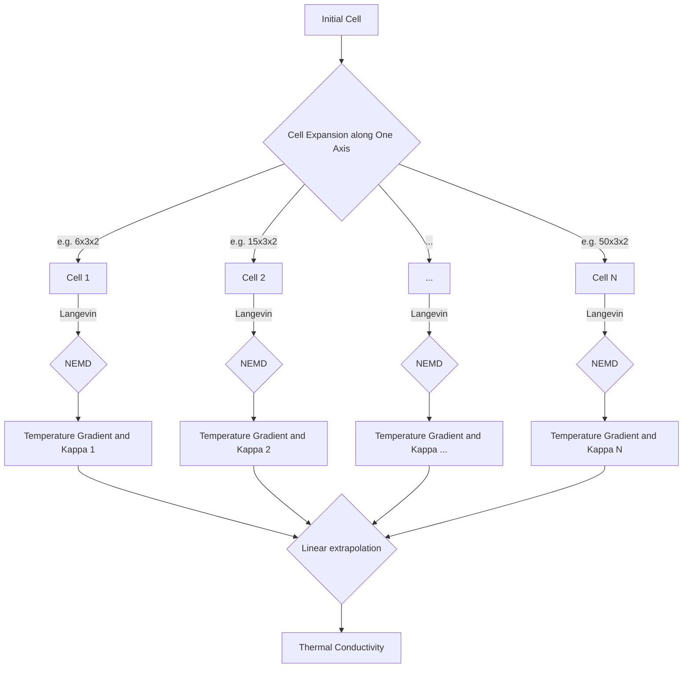

# Table of contents
- [About ThermalConductivity-Workflow](#ThermalConductivity-Workflow)
- [Workflow Framework](#Workflow-Framework)
- [Prepare Input File](#Prepare-input-file)
# About ThermalConductivity-Workflow
ThermalConductivity-Workflow is designed to compute thermal conductivity of different materials based on Non-Equilibrium &amp; Equilibrium Molecular Dynamics Simulations.It is supported by [dflow](https://github.com/deepmodeling/dflow), a Python framework for constructing scientific computing workflows.

# Environment Installation
* dflow, the necessary package in the host machine
* computational environment, needed in both host and computing machine
## Installation of dflow
With the power of dflow, users can easily minitor the whole workflow of ThermalConductivity tasks and dispatch their tasks to various computational resources. Before you use it, you should have dflow installed on your host computer (your PC or a remote server).

It it necessary to emphasize that, the computational nodes and monitor nodes are seperated. With dflow, you can deploy dflow and ThermalConductivity on your PC and achieve expensive computation on other resources (like Slurm and Cloud Platform) without any further effort.

Instructions of dflow installation are provided in detail on its [Github page](https://github.com/deepmodeling/dflow#Installdflow). Prerequisites of dflow usage are Docker and Kubenetes, where their main pages ([Docker](https://docs.docker.com/engine/install/) &amp; [Kubenetes](https://kubernetes.io/docs/tasks/tools/) include how you can install them. Besides, dflow repo also provides with easy-install shell scripts on [dflow/scripts](https://github.com/deepmodeling/dflow/tree/master/scripts) to install Docker &amp; Kubenetes &amp; dflow and make port-forwarding.

## Installation of computational environment
The computational environment is supported by several third-party python packages.The following packages should be installed  both on host &amp; computing machines:
* deepmd-kit & plumed lammps
* dpdata
* matplotlib
* [sportran](https://sportran.readthedocs.io/en/latest/README.html#installation)

One may create a GPU environment containing the GPU version of DeePMD-kit and LAMMPS as following commands.Or look for more detailed installation options in deepmd-kit [easy-install](https://github.com/deepmodeling/deepmd-kit/blob/master/doc/install/easy-install.md)
```bash
conda create -n deepmd deepmd-kit=*=*gpu libdeepmd=*=*gpu lammps cudatoolkit=11.6 horovod -c https://conda.deepmodeling.com -c defaults
```

One can install other packages with following commands:
```bash
conda install -c conda-forge dpdata
pip install sportran
conda install -c conda-forge matplotlib-base
```
# Workflow Framework
## EMD(Equilibrium Molecular Dynamics Simulations) 
The process of computing thermal conductivities with EMD is as follows:


## NEMD(Non-Equilibrium Molecular Dynamics Simulations) 
The process of computing thermal conductivities with NEMD is as follows:

# Prepare Input Files
Firstly, we introduce the input files required for the ThermalConductivity.Input files in example/ have been prepared. 
The following files is needed:
* data.lammps, the input structure file of lammps format
* run.py, the main code to run the whole workflow, run_emd.py and run_nemd.py have been prepared
* parameters.json, the settings for simulations and tasks
* input_gen.py, the code to generate corresponding lammps input file
* force field(if needed), the force field file used in lammps MD

## Prepare run.py
The Function **slurm_remote_executor** should be setted for using remote computing resources. The varible **'your-jobname'**,**'your-env'** and **'your-workdir'** should be replaced in actual use

 ```Python
 slurm_remote_executor = SlurmRemoteExecutor(
        host="",
        port=22,
        username="",
        password="",
        header="""#!/bin/bash
#SBATCH --job-name="your-jobname"
#SBATCH --error=./err.txt
#SBATCH --output=./stdout.inf
#SBATCH --gpus=1
#SBATCH --time=1000:00:00
source activate your-env-name
        """,
        workdir="/your-workdir"+"/{{workflow.name}}/{{pod.name}}",
    )
 ```
 
 The relevant settings of dflow should also be setted in run.py
 
## Prepare parameters.json
### parameters.json of EMD
parameters.json for emd in /example/emd/H2O 
```Json
{
    "type_map": ["C","H"],
    "mass_map": [12.0107,1.00794],
    "temperature":300,
    "time_step": 0.0005,
    "thermo_print_interval": 10,
    "traj_print_interval": 1000,
    "structure":"./data.pentacene3x3x3",
    "is_two-body-potential":false,
    "force_field":["frozen_model_compressed.pb"],
    "load_force_field":"pair_style deepmd frozen_model_compressed.pb\npair_coeff * *\n",
    "num_configurations":50,
    "NVT_steps":1000000,
    "NVE_steps":2000000
}
```

Description of parameters

| Parameters| Type          | Description  |
| --------------------- | ---------------------- | -------------------------- |
| type_map     | List of str       |                   |


### parameters.json of NEMD
```Json
{
    "type_map": ["H","O"],
    "mass_map": [1,16],
    "time_step": 0.0005,
    "supercell": [[4,1,1],[5,1,1],[6,1,1],[8,1,1],[10,1,1],[15,1,1]],
    "temperature":408,
    "temperature_difference":30,
    "linear_scale":[0.10,0.90],
    "thermo_print_interval": 1000,
    "traj_print_interval": 1000,
    "structure":"./data.water",
    "force_field":["frozen_model_compressed.pb"],
    "load_force_field":"pair_style deepmd frozen_model_compressed.pb\npair_coeff * *\n",
    "langevin_damp":0.5,
    "NVT_steps":20000,
    "NEMD_equilibrium_steps":200000,
    "NEMD_production_steps":2000000,
    "num_configurations":10
}
```
